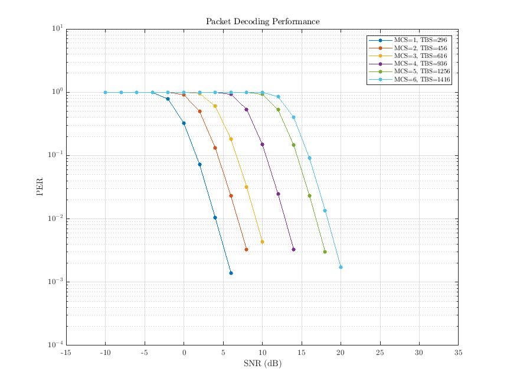
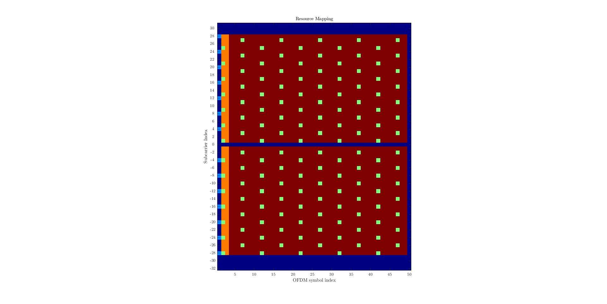

# DECT 2020 New Radio Link-Level Simulation Environment
This program contains a Matlab link-level simulation environment for the ETSI standard DECT 2020 New Radio (NR+) (ETSI TS 103 636 v2).
This software was initially developed by Maxim Penner and Roman Glazkov, this particular version is maintained by Alexander Pyattaev. Importantly, this is a hard fork, and was not intended to be compatible with upstream implementation. 

[DECT Introduction](https://www.etsi.org/technologies/dect)

The standard consists of multiple parts which can be found on the DECT Technical Committee (TC) webpage.

[DECT committee page](https://www.etsi.org/committee/1394-dect)

## Capabilities
The complete physical layer of a DECT NR + transmitter is implemented. This includes all bandwidths, MIMO modes, channel coding etc. Additionally, BERs and PERs can be simulated in different wireless channel models, in particular doubly-selective channels. For the receiver, STO and CFO synchronization as well as most MIMO modes have been implemented. 

## Limitations

- The simulation does not model the actual contents of PCC or PDC sections of the packet, and as such is not a protocol level simulator. You should not rely on this tool to model packet headers and other such MAC-related issues. 

## ToDo
- [ ] implement basic MIMO algorithms for NSS > 1
- [ ] add phase error gradient correction due to SCO

## Main Scripts
- **main_standalone.m**: entry point to run simulations based off data in mat file with parameters. Useful for runs in SLURM etc.
- **test_all.m**: script to run `main_standalone.m` with reasonable parameters if you want to test things out.

## Requirements
The Matlab LTE Toolbox is required for channel coding and the Communications Toolbox for wireless channel simulation.

## Exemplary Results

### Packet Error Rates (PERs)
PERs of a SIMO (two receive antennas) system for different MCS over SNR in a Rician fading channel.

  

### Resource Mapping
Resource mapping of STF, DRS, PCC and PDC in the time-frequency lattice.

  

### Channel Interpolation
Interpolated average path gains for a doubly selective channel.

  

